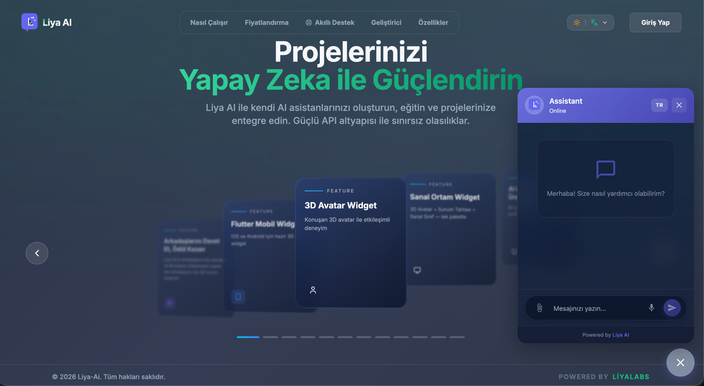
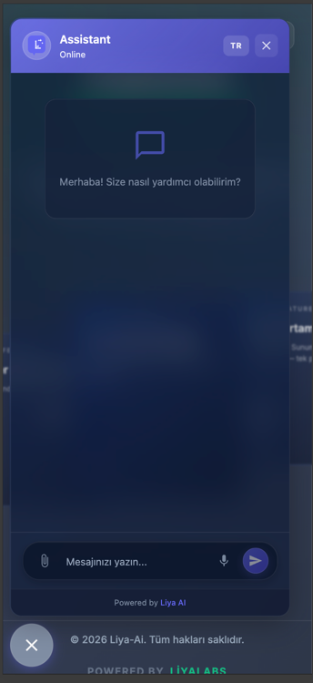
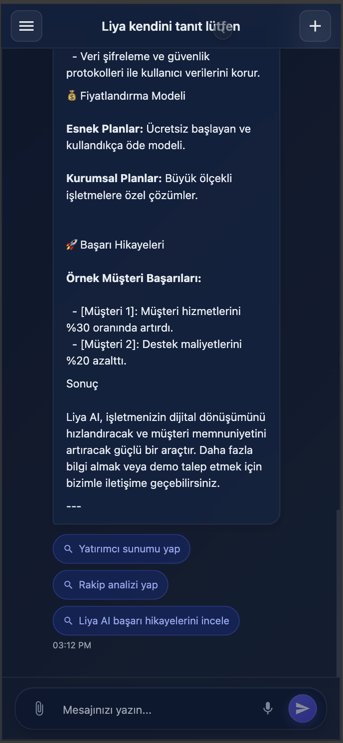
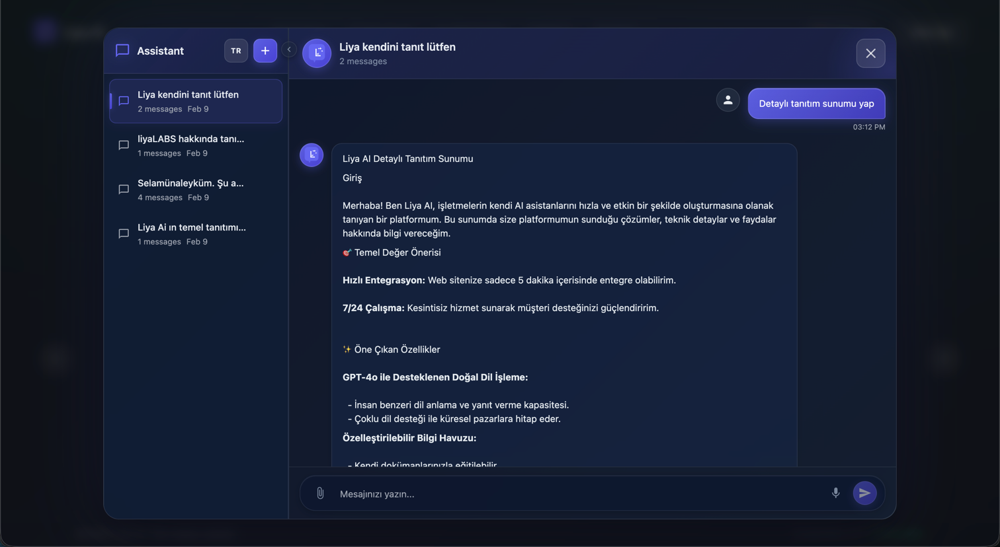
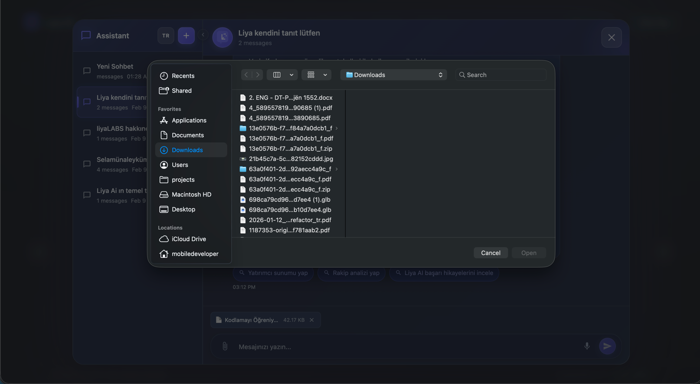
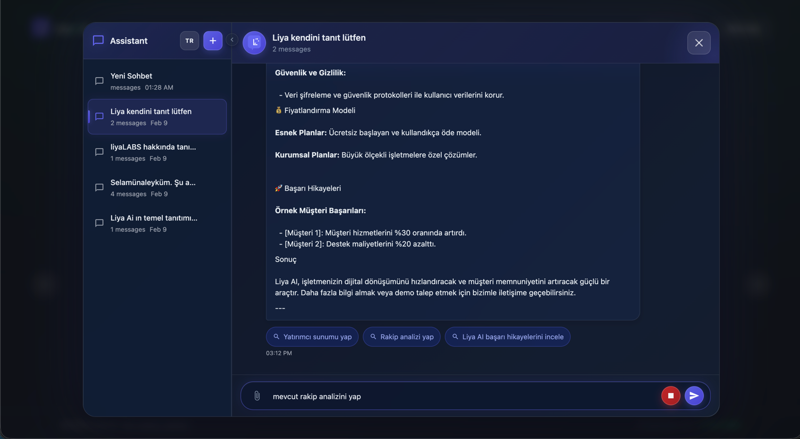

# @liyalabs/liya-ai-chat-vue

Vue.js Chat Widget & Full App Component for Liya AI Assistants.

[](https://www.npmjs.com/package/@liyalabs/liya-ai-chat-vue)
[](https://opensource.org/licenses/MIT)

> **[Live Demo →](https://ai.liyalabs.com)** &nbsp;|&nbsp; **[Website →](https://liyalabs.com)**

## Screenshots

### Widget Mode (Floating Chat)

| Desktop | Mobile |
|---------|--------|
|  |  |

### App Mode (Full Chat Interface)

| Desktop | Mobile |
|---------|--------|
|  |  |

### Features

| Session History | File Upload | Voice Input |
|----------------|-------------|-------------|
|  |  |  |

## Features

- 🎨 **Two Modes**: Widget (floating chatbox) & App (full chat interface)
- 💬 **Real-time Chat**: Send messages and receive AI responses
- 📁 **File Upload**: Attach files to your messages
- 🎤 **Voice Input**: Speech-to-text support
- 📜 **Session History**: Browse and continue previous conversations
- 🎯 **Customizable**: Theme, colors, position, and more
- 📱 **Responsive**: Mobile-friendly design
- 🔒 **TypeScript**: Full type support

## Installation

```bash
npm install @liyalabs/liya-ai-chat-vue
# or
yarn add @liyalabs/liya-ai-chat-vue
# or
pnpm add @liyalabs/liya-ai-chat-vue
```

## Quick Start

### Widget Mode (Website Helper)

Perfect for embedding a chat widget on your website.

```typescript
// main.ts
import { createApp } from 'vue'
import App from './App.vue'
import { LiyaChatPlugin } from '@liyalabs/liya-ai-chat-vue'
import '@liyalabs/liya-ai-chat-vue/style.css'

const app = createApp(App)

app.use(LiyaChatPlugin, {
  mode: 'widget',
  apiKey: 'liwhai_your_api_key_here',
  baseUrl: 'https://app-X-ai.liyalabs.com', // Your assigned backend URL (see GAR section)
  assistantId: 'your-assistant-uuid',
  assistantName: 'Destek Asistanı',
  theme: {
    primaryColor: '#6366f1',
    position: 'bottom-right'
  }
})

app.mount('#app')
```

```vue
<!-- App.vue -->
<template>
  <div>
    <h1>My Website</h1>
    <!-- Widget will appear automatically -->
    <LiyaChatWidget 
      welcome-message="Merhaba! Size nasıl yardımcı olabilirim?"
      :show-voice="true"
      :show-file-upload="true"
    />
  </div>
</template>
```

### App Mode (Full Chat Application)

For building a complete chat interface with session management.

```typescript
// main.ts
import { createApp } from 'vue'
import App from './App.vue'
import { LiyaChatPlugin } from '@liyalabs/liya-ai-chat-vue'
import '@liyalabs/liya-ai-chat-vue/style.css'

const app = createApp(App)

app.use(LiyaChatPlugin, {
  mode: 'app',
  apiKey: 'liwhai_your_api_key_here',
  baseUrl: 'https://app-X-ai.liyalabs.com', // Your assigned backend URL (see GAR section)
  assistantId: 'your-assistant-uuid',
  assistantName: 'AI Assistant',
  features: {
    voice: true,
    fileUpload: true,
    sessionHistory: true
  }
})

app.mount('#app')
```

```vue
<!-- App.vue -->
<template>
  <div class="chat-container">
    <LiyaChatApp 
      :show-sidebar="true"
      sidebar-width="320px"
      welcome-message="Merhaba! Yeni bir sohbet başlatın."
      :show-voice="true"
      :show-file-upload="true"
      @session-created="onSessionCreated"
      @message-sent="onMessageSent"
    />
  </div>
</template>

<script setup>
function onSessionCreated(session) {
  console.log('New session:', session)
}

function onMessageSent(message) {
  console.log('Message sent:', message)
}
</script>

<style>
.chat-container {
  height: 100vh;
  width: 100%;
}
</style>
```

## Configuration

### Plugin Options

| Option | Type | Required | Description |
|--------|------|----------|-------------|
| `mode` | `'widget' \| 'app'` | No | Chat mode (default: both components registered) |
| `apiKey` | `string` | Yes | Your Liya API key |
| `baseUrl` | `string` | Yes | API base URL |
| `assistantId` | `string` | Yes | Assistant UUID |
| `assistantName` | `string` | No | Display name for the assistant |
| `theme` | `ThemeConfig` | No | Theme customization |
| `features` | `FeaturesConfig` | No | Feature toggles |

### Theme Configuration

```typescript
interface ThemeConfig {
  primaryColor?: string      // Main brand color (default: #6366f1)
  secondaryColor?: string    // Secondary color
  backgroundColor?: string   // Background color
  textColor?: string         // Text color
  fontFamily?: string        // Font family
  borderRadius?: string      // Border radius
  position?: 'bottom-right' | 'bottom-left' | 'top-right' | 'top-left'
  zIndex?: number            // Z-index for widget
}
```

### Features Configuration

```typescript
interface FeaturesConfig {
  voice?: boolean           // Enable voice input (default: true)
  fileUpload?: boolean      // Enable file upload (default: true)
  sessionHistory?: boolean  // Enable session history (default: true)
  markdown?: boolean        // Render markdown in messages
  typingIndicator?: boolean // Show typing indicator
}
```

## Components

### LiyaChatWidget

Floating chat widget for websites.

```vue
<LiyaChatWidget
  position="bottom-right"
  :theme="{ primaryColor: '#6366f1' }"
  welcome-message="Merhaba!"
  placeholder="Mesajınızı yazın..."
  :show-branding="true"
  :show-voice="true"
  :show-file-upload="true"
  @opened="onWidgetOpened"
  @closed="onWidgetClosed"
  @message-sent="onMessageSent"
  @message-received="onMessageReceived"
/>
```

### LiyaChatApp

Full chat application with sidebar.

```vue
<LiyaChatApp
  :theme="{ primaryColor: '#6366f1' }"
  :show-sidebar="true"
  sidebar-width="300px"
  welcome-message="Yeni sohbet başlatın"
  placeholder="Mesajınızı yazın..."
  :show-voice="true"
  :show-file-upload="true"
  @session-created="onSessionCreated"
  @session-selected="onSessionSelected"
  @session-deleted="onSessionDeleted"
  @message-sent="onMessageSent"
  @message-received="onMessageReceived"
/>
```

## Composables

Use composables for custom implementations:

```typescript
import { useChat, useSessions, useVoice, useFileUpload } from '@liyalabs/liya-ai-chat-vue'

// Chat functionality
const { 
  messages, 
  isLoading, 
  sendMessage, 
  loadHistory, 
  clearMessages 
} = useChat()

// Session management
const { 
  sessions, 
  currentSession, 
  loadSessions, 
  createSession, 
  deleteSession 
} = useSessions()

// Voice input
const { 
  isRecording, 
  transcript, 
  startRecording, 
  stopRecording 
} = useVoice()

// File upload
const { 
  pendingFiles, 
  uploadedFiles, 
  addFiles, 
  uploadFiles 
} = useFileUpload()
```

## API Functions

Direct API access:

```typescript
import { 
  sendMessage, 
  getSessions, 
  createSession, 
  getSessionHistory,
  uploadFile,
  getAssistants 
} from '@liyalabs/liya-ai-chat-vue'

// Send a message
const response = await sendMessage('Hello!', sessionId)

// Get sessions
const { sessions } = await getSessions()

// Create new session
const session = await createSession('New Chat')

// Get message history
const { messages } = await getSessionHistory(sessionId)

// Upload file
const file = await uploadFile(sessionId, fileObject)
```

## Styling

### CSS Variables

Override CSS variables for custom styling:

```css
:root {
  --liya-primary-color: #6366f1;
  --liya-primary-hover: #4f46e5;
  --liya-bg-color: #ffffff;
  --liya-bg-secondary: #f3f4f6;
  --liya-text-color: #374151;
  --liya-text-muted: #9ca3af;
  --liya-border-color: #e5e7eb;
  --liya-border-radius: 12px;
  --liya-font-family: system-ui, sans-serif;
}
```

### Dark Mode

The package supports dark mode via CSS media query:

```css
@media (prefers-color-scheme: dark) {
  :root {
    --liya-bg-color: #1f2937;
    --liya-bg-secondary: #374151;
    --liya-text-color: #f9fafb;
    --liya-border-color: #4b5563;
  }
}
```

## TypeScript

Full TypeScript support with exported types:

```typescript
import type {
  LiyaChatConfig,
  ThemeConfig,
  Session,
  Message,
  Assistant,
  FileAttachment
} from '@liyalabs/liya-ai-chat-vue'
```

## Browser Support

- Chrome (latest)
- Firefox (latest)
- Safari (latest)
- Edge (latest)

## GAR (Global Application Router)

Liya AI uses a distributed backend architecture. Each user is assigned to a specific backend instance based on their account.

### Finding Your Backend URL

Your backend URL is displayed in your Liya AI dashboard under **Settings > API Configuration**. It follows this pattern:

```
https://app-{X}-ai.liyalabs.com
```

Where `{X}` is your assigned instance number (1, 2, 3, etc.).

### Examples

| Instance | Backend URL |
|----------|-------------|
| 1 | `https://app-1-ai.liyalabs.com` |
| 2 | `https://app-2-ai.liyalabs.com` |
| 3 | `https://app-3-ai.liyalabs.com` |

### Dynamic Configuration

For production apps, we recommend fetching your backend URL dynamically:

```typescript
// Fetch config from your backend or environment
const config = await fetch('/api/config').then(r => r.json())

app.use(LiyaChatPlugin, {
  apiKey: config.apiKey,
  baseUrl: config.baseUrl, // Dynamic from GAR
  assistantId: config.assistantId,
  // ...
})
```

## Live Demo

See the widget in action:

- **Full Platform**: [ai.liyalabs.com](https://ai.liyalabs.com) — Create an assistant and use the chat widget & app mode
- **Website**: [liyalabs.com](https://liyalabs.com) — See the chat widget embedded on a live website

## License

MIT © Liya Labs

## Support

- 🌐 Website: [liyalabs.com](https://liyalabs.com)
- 📖 Documentation: [ai.liyalabs.com/developer](https://ai.liyalabs.com/developer)
- 🐛 Issues: [GitHub Issues](https://github.com/liyalabs/liya-ai-chat/issues)
- 📧 Email: support@liyalabs.com
